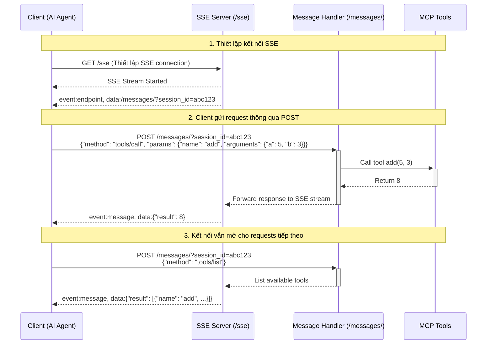

Khi client gửi một yêu cầu đến `/sse` (thường là một yêu cầu `GET`), server sẽ giữ kết nối này mở vô thời hạn. Kết nối này hoạt động như một "kênh" để server có thể liên tục gửi các sự kiện và dữ liệu cho client

Vì kết nối SSE (`/sse`) vốn chỉ một chiều (server-tới-client), cần có một cơ chế để client gửi thông tin ngược lại cho server. Đây chính là vai trò của endpoint `/messages`.

Bản chất của endpoint `/messages` là một **API endpoint HTTP tiêu chuẩn** (thường là phương thức `POST`) để client gửi các yêu cầu, lệnh hoặc dữ liệu cho server. Ví dụ, khi người dùng nhập một câu lệnh cho trợ lý AI, client sẽ đóng gói câu lệnh đó và gửi nó qua một yêu cầu `POST` đến `/messages`.

`"POST /messages/?session_id=c52c7301ae504c2caf598fa5f045d5e1 HTTP/1.1" 202`

Trong yêu cầu trên, sự xuất hiện của `session_id` là cực kỳ quan trọng để giải quyết tính "không trạng thái" (stateless) của giao thức HTTP.

- **Tại sao cần `session_id`?** Mỗi yêu cầu HTTP `POST` đến `/messages` là một yêu cầu độc lập. Server, khi nhận được yêu cầu này, không tự biết nó đến từ client nào trong số hàng ngàn client đang kết nối. `session_id` hoạt động như một "chứng minh thư" định danh, giúp server xác định chính xác yêu cầu này thuộc về phiên giao tiếp (kết nối `/sse`) nào.
    
- **`session_id` được lưu ở đâu và bản chất là gì?**
    
    1. **Khởi tạo:** Khi client lần đầu kết nối tới endpoint `/sse`, server sẽ tạo ra một `session_id` duy nhất cho phiên kết nối đó.
        
    2. **Gửi về client:** `session_id` này sẽ được server gửi lại cho client như một phần của dữ liệu khởi tạo kết nối SSE.
        
    3. **Lưu trữ phía client:** Client sẽ lưu trữ `session_id` này.
        
    4. **Sử dụng:** Mỗi khi client cần gửi dữ liệu gì đó cho server, nó sẽ đính kèm `session_id` này vào yêu cầu (trong trường hợp này là một query parameter trong URL của yêu cầu `POST` tới `/messages`).
        
    5. **Xử lý phía server:** Server sẽ dựa vào `session_id` để tra cứu và tìm ra đúng kênh kết nối `/sse` của client đó. Nhờ vậy, server có thể xử lý yêu cầu và gửi phản hồi (nếu có) ngược lại cho đúng client thông qua kênh SSE đã được thiết lập từ trước.