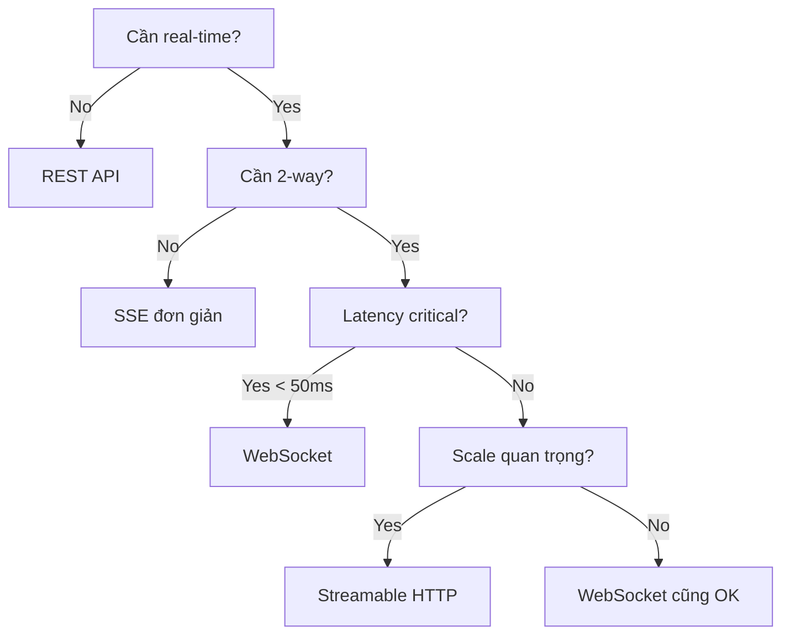

# REST API vs Streaming vs Real-time Updates

## 🔵 REST API vs Streaming Technologies

### REST API Truyền thống:

```javascript
// REST: Request → Wait → Full Response → Done
// Giống như order đồ ăn: Order → Chờ → Nhận món (đầy đủ) → Xong

// Example: Get user data
const response = await fetch('/api/users/123');
const user = await response.json(); // Đợi TOÀN BỘ data
console.log(user); // { id: 123, name: "John", ... }

// Example: Upload file
const response = await fetch('/api/upload', {
  method: 'POST',
  body: formData
});
// Đợi upload XONG HẾT mới có response
const result = await response.json(); // { success: true }
```

### Streaming (SSE/WebSocket/Streamable HTTP):

```javascript
// Streaming: Request → Receive chunk 1 → chunk 2 → chunk 3 → ...
// Giống như xem Netflix: Không cần đợi download hết phim

// SSE Example: Live scores
const eventSource = new EventSource('/api/live-scores');
eventSource.onmessage = (event) => {
  // Nhận từng update, không đợi "hết trận"
  updateScore(JSON.parse(event.data)); // Chunk 1, 2, 3...
};

// Streamable HTTP: AI Response
const response = await fetch('/api/chat', { 
  method: 'POST',
  body: JSON.stringify({ prompt: "Explain quantum physics" })
});

const reader = response.body.getReader();
let result = '';
while (true) {
  const { done, value } = await reader.read();
  if (done) break;
  
  const chunk = new TextDecoder().decode(value);
  result += chunk;
  displayPartialResponse(result); // Show từng từ như ChatGPT
}
```

## 📊 So sánh REST vs Streaming

|Aspect|REST API|Streaming|
|---|---|---|
|**Response**|Toàn bộ cùng lúc|Từng phần (chunks)|
|**Waiting**|Đợi complete|Xử lý ngay khi có data|
|**Connection**|Close sau response|Giữ mở để stream|
|**Use case**|CRUD operations|Live updates, progress|
|**Example**|Get user profile|Live chat, stock prices|

## 🔄 Streaming là gì?

### Định nghĩa đơn giản:

**Streaming** = Nhận data từng phần, xử lý ngay, không đợi hết

### Ví dụ thực tế:

#### 1. **Video Streaming (YouTube)**

```javascript
// KHÔNG phải Streaming - Download toàn bộ
const video = await fetch('/movie.mp4'); // Đợi 2GB download xong
const blob = await video.blob();
videoElement.src = URL.createObjectURL(blob);

// Streaming - Xem ngay
videoElement.src = '/stream/movie.mp4'; // Play ngay chunk đầu tiên
// Browser tự fetch chunks tiếp theo khi cần
```

#### 2. **ChatGPT/Claude Response**

```javascript
// KHÔNG phải Streaming
const response = await fetch('/api/generate');
const { text } = await response.json();
displayText(text); // Show toàn bộ 1 lúc

// Streaming - Show từng từ
const stream = await fetch('/api/generate/stream');
const reader = stream.body.getReader();

while (true) {
  const { done, value } = await reader.read();
  if (done) break;
  
  const text = decoder.decode(value);
  appendText(text); // "Hello" → "Hello, how" → "Hello, how can" → ...
}
```

#### 3. **File Upload với Progress**

```javascript
// REST API - Không biết progress
const response = await fetch('/upload', {
  method: 'POST',
  body: largeFile
});
// Đợi... (không biết % nào)
alert('Upload done!');

// Streaming - Biết progress
const xhr = new XMLHttpRequest();
xhr.upload.onprogress = (e) => {
  const percent = (e.loaded / e.total) * 100;
  updateProgressBar(percent); // 10%... 50%... 100%
};
```

## ⚡ Real-time Update là gì?

### Định nghĩa:

**Real-time Update** = Nhận thông tin ngay khi có thay đổi, không cần polling

### So sánh Polling vs Real-time:

#### Polling (REST API cũ):

```javascript
// Polling - Hỏi đi hỏi lại "Có gì mới không?"
// Giống như F5 Facebook liên tục

setInterval(async () => {
  const response = await fetch('/api/notifications');
  const notifs = await response.json();
  if (notifs.length > 0) {
    showNotifications(notifs);
  }
}, 5000); // Hỏi mỗi 5 giây = lãng phí
```

#### Real-time (SSE/WebSocket):

```javascript
// Real-time - Server tự push khi có update
// Giống như notification tự hiện trên điện thoại

// SSE
const events = new EventSource('/api/notifications/stream');
events.onmessage = (e) => {
  // Server push ngay khi có notification mới
  showNotification(JSON.parse(e.data));
};

// WebSocket
ws.onmessage = (e) => {
  // Nhận ngay lập tức
  handleRealtimeUpdate(JSON.parse(e.data));
};
```

## 👥 Multi-client Support

### SSE với Multi-client:

```javascript
// Server phải maintain riêng mỗi client connection
const clients = new Set();

app.get('/events', (req, res) => {
  // Setup SSE cho client này
  res.writeHead(200, {
    'Content-Type': 'text/event-stream',
    'Cache-Control': 'no-cache',
  });
  
  // Lưu client connection
  clients.add(res);
  
  // Khi có event, broadcast đến TẤT CẢ clients
  broadcastToAll(event) {
    clients.forEach(client => {
      client.write(`data: ${JSON.stringify(event)}\n\n`);
    });
  }
  
  // Problem: Mỗi client = 1 connection riêng
  // 1000 clients = 1000 connections!
});
```

### Streamable HTTP với Multi-client:

```javascript
// HTTP/2 Multiplexing - Ít connections hơn
app.post('/stream', async (req, res) => {
  // HTTP/2 cho phép nhiều streams trên 1 connection
  // Server push different data cho different clients
  
  const userId = req.user.id;
  const personalStream = createPersonalizedStream(userId);
  
  // Mỗi client có thể có logic riêng
  personalStream.pipe(res);
});

// Advantages:
// 1. Fewer TCP connections (HTTP/2 multiplexing)
// 2. Each stream can have different logic
// 3. Better resource utilization
```

### Ví dụ thực tế Multi-client:

#### 1. **Live Sports - Hàng triệu viewers**

```javascript
// SSE approach - Simple nhưng tốn resources
class SportsSSE {
  constructor() {
    this.clients = new Set();
  }
  
  broadcast(score) {
    // Gửi cho TẤT CẢ clients
    this.clients.forEach(client => {
      client.write(`data: ${JSON.stringify(score)}\n\n`);
    });
  }
}

// Streamable HTTP - Flexible hơn
class SportsStream {
  async handleClient(req, res) {
    const { premium, team } = req.user;
    
    // Có thể personalize cho từng user
    if (premium) {
      streamWithStats(res); // Premium users: stats + score
    } else {
      streamScoreOnly(res); // Free users: score only
    }
  }
}
```

#### 2. **Collaborative Editing (Google Docs)**

```javascript
// SSE - Khó sync 2 chiều
// Client 1 edit → POST to server → Server SSE to others
// Phức tạp khi nhiều người edit cùng lúc

// Streamable HTTP - Better
const docStream = await fetch('/api/doc/123/collaborate', {
  method: 'POST',
  duplex: 'half',
  body: new ReadableStream({
    // Send edits
    start(controller) {
      onUserEdit((edit) => {
        controller.enqueue(JSON.stringify(edit));
      });
    }
  })
});

// Receive others' edits
const reader = docStream.body.getReader();
while (true) {
  const { done, value } = await reader.read();
  if (done) break;
  applyRemoteEdit(JSON.parse(decoder.decode(value)));
}
```

## 📊 Tổng kết sự khác biệt

### REST API:

- ✅ Simple, stateless
- ✅ Cacheable
- ❌ Không real-time
- ❌ Polling inefficient
- 📱 Use case: CRUD, forms

### SSE:

- ✅ Real-time updates
- ✅ Auto-reconnect
- ❌ One-way only
- ❌ 1 connection/client
- 📱 Use case: Notifications, live feeds

### Streamable HTTP:

- ✅ Bidirectional
- ✅ HTTP/2 efficiency
- ✅ Flexible per-client logic
- ❌ Complex implementation
- 📱 Use case: AI apps, collaboration

### WebSocket:

- ✅ Lowest latency
- ✅ Full duplex
- ❌ Difficult scaling
- ❌ No HTTP benefits
- 📱 Use case: Gaming, trading, chat app

## 💡 Chọn technology nào?


