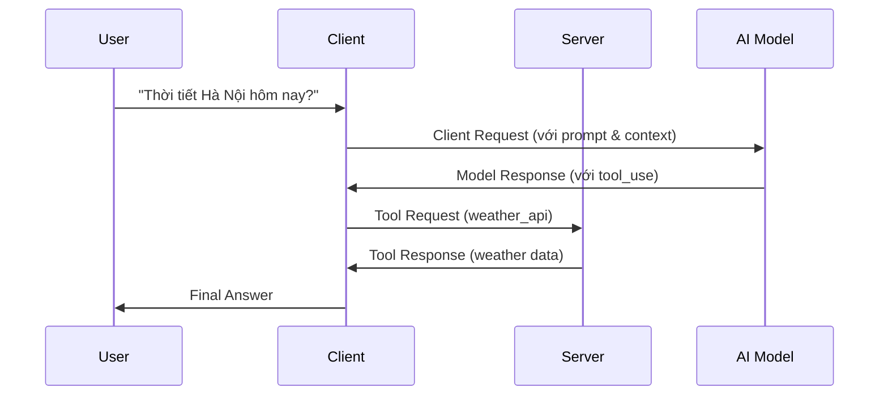

# MCP Protocol Messages - Giải thích và Ví dụ

MCP sử dụng **JSON messages có cấu trúc** để đảm bảo giao tiếp rõ ràng và đáng tin cậy. Dưới đây là 4 loại message chính:

## 1. 📤 Client Request

**Mô tả:** Message được gửi từ client đến server, chứa yêu cầu của người dùng.

**Thành phần chính:**

- User's prompt/command
- Conversation history
- Tool configuration
- Metadata/session info

### Ví dụ Client Request:

```json
{
  "jsonrpc": "2.0",
  "id": "req_001",
  "method": "completion/complete",
  "params": {
    "prompt": {
      "messages": [
        {
          "role": "user",
          "content": "Tìm giúp tôi thông tin thời tiết Hà Nội hôm nay"
        }
      ]
    },
    "conversation_history": [
      {
        "role": "user", 
        "content": "Xin chào",
        "timestamp": "2024-07-17T09:00:00Z"
      },
      {
        "role": "assistant",
        "content": "Chào bạn! Tôi có thể giúp gì cho bạn?",
        "timestamp": "2024-07-17T09:00:01Z"
      }
    ],
    "tool_configuration": {
      "available_tools": ["weather_api", "web_search"],
      "permissions": ["read", "external_api"]
    },
    "metadata": {
      "session_id": "sess_12345",
      "user_location": "Hanoi, VN",
      "language": "vi"
    }
  }
}
```

## 2. 🤖 Model Response

**Mô tả:** Phản hồi từ AI model (thông qua client), chứa kết quả được tạo ra.

**Thành phần chính:**

- Generated text/completion
- Tool call instructions (optional)
- Resource references

### Ví dụ Model Response:

```json
{
  "jsonrpc": "2.0",
  "id": "req_001", 
  "result": {
    "content": [
      {
        "type": "text",
        "text": "Tôi sẽ giúp bạn tìm thông tin thời tiết Hà Nội hôm nay."
      },
      {
        "type": "tool_use",
        "id": "tool_call_001",
        "name": "weather_api",
        "input": {
          "location": "Hanoi",
          "date": "2024-07-17",
          "units": "metric"
        }
      }
    ],
    "model": "claude-sonnet-4",
    "usage": {
      "input_tokens": 125,
      "output_tokens": 45
    },
    "references": [
      "resource://weather-service/current"
    ]
  }
}
```

## 3. 🔧 Tool Request

**Mô tả:** Yêu cầu từ client đến server để thực thi một tool cụ thể.

**Thành phần chính:**

- Tool name
- Required parameters
- Context/tracking info

### Ví dụ Tool Request:

```json
{
  "jsonrpc": "2.0",
  "id": "tool_req_001",
  "method": "tools/call",
  "params": {
    "name": "weather_api",
    "arguments": {
      "location": "Hanoi",
      "date": "2024-07-17", 
      "units": "metric",
      "language": "vi"
    },
    "context": {
      "request_id": "req_001",
      "tool_call_id": "tool_call_001",
      "user_session": "sess_12345"
    },
    "metadata": {
      "timestamp": "2024-07-17T09:00:05Z",
      "source": "model_completion"
    }
  }
}
```

## 4. ⚙️ Tool Response

**Mô tả:** Kết quả trả về từ server sau khi thực thi tool.

**Thành phần chính:**

- Execution results
- Error/status information
- Additional metadata

### Ví dụ Tool Response (Thành công):

```json
{
  "jsonrpc": "2.0",
  "id": "tool_req_001",
  "result": {
    "content": [
      {
        "type": "text",
        "text": "Thời tiết Hà Nội hôm nay"
      },
      {
        "type": "resource",
        "resource": {
          "uri": "weather://hanoi/2024-07-17",
          "name": "Hanoi Weather Today",
          "description": "Current weather conditions in Hanoi"
        }
      }
    ],
    "data": {
      "temperature": 28,
      "humidity": 75,
      "condition": "Partly Cloudy",
      "wind_speed": 12,
      "visibility": 10
    },
    "execution_time": "0.234s",
    "metadata": {
      "source": "OpenWeatherMap API",
      "last_updated": "2024-07-17T08:55:00Z",
      "cache_status": "fresh"
    }
  }
}
```

### Ví dụ Tool Response (Lỗi):

```json
{
  "jsonrpc": "2.0", 
  "id": "tool_req_001",
  "error": {
    "code": -32000,
    "message": "Weather API call failed",
    "data": {
      "error_type": "API_TIMEOUT",
      "details": "Request to weather service timed out after 5 seconds",
      "retry_after": 30,
      "logs": [
        "2024-07-17T09:00:05Z: Connecting to weather API...",
        "2024-07-17T09:00:10Z: Connection timeout"
      ]
    }
  }
}
```

## 🔄 Quy trình hoạt động



## 💡 Điểm quan trọng

- **Cấu trúc nhất quán**: Tất cả message đều follow JSON-RPC 2.0 standard
- **Traceability**: Mỗi message có ID để track và debug
- **Error handling**: Cơ chế báo lỗi rõ ràng với error codes
- **Metadata**: Thông tin bổ sung giúp context và monitoring
- **Flexibility**: Schema linh hoạt cho different tool types và use cases